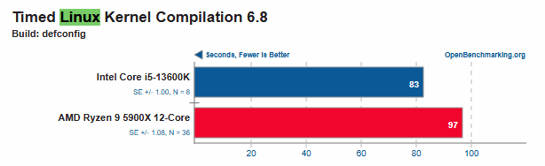

# Trabajo practico de Laboratorio n°1: Primera Parte
## Lista de benchmarks:

### Benchmarks Sintéticos
* **Dhrystone**: Evalua el rendimiento de la CPU en operaciones con enteros.

* **Whetstone**: Mide el rendimiento en calculos de punto flotante.

* **LINPACK**: Evalua la capacidad de la CPU para resolver sistemas de ecuaciones.

### Benchmarks Reducidos
* **Livermore Loops**: Evalua el rendimiento en la ejecucion de bucles intensivos en calculos. 

* **STREAM**: MIde el ancho de banda de memoria en operaciones secuenciales 

### Benchmarks Kernel o Núcleo
* **Imbench**: Mide las latencias de memoria, ancho de banda y rendimiento de llamadas al sistema.

* **FIO**: Evalua el rendimiento de entrada/salida en discos y sistemas de archivos.

### Programas Reales
* **SPEC CPU**: Evalua el rendimiento general del sistema con carga de trabajo reales.

* **TPC-C**: Analiza el rendimiento en bases de datos con simulaciones de transacciones comerciales.

* **Blender Benchmark**: Prueba la capacidad de la CPU y GPU en renderizado 3D.
---

## Mas utiles para diferentes Perfiles:

### Perfil de Franco:
Se centra en proyectos de software afines a la carrera, haciendo uso de interacciones con llamadas del sistema operativo como en la materia de "Sistemas operativos I y II". Como pasatiemp, juega videojuegos.

### Benchmarks mas utiles para este perfil:

#### **1. Benchmarks Específicos:**

| Benchmark               | Tipo de Medición                  | Relevancia para Franco                                                                 |
|-------------------------|-----------------------------------|---------------------------------------------------------------------------------------|
| **lmbench**             | Llamadas al sistema, latencias    | Mide `fork()`, `read()`, `write()`, clave para proyectos de SO.                       |
| **FIO**                 | Rendimiento de disco              | Optimiza tiempos de carga de juegos y compilaciones.                                  |
| **build-linux-kernel**  | Tiempo de compilación (PTS)       | Evalúa rendimiento de CPU/ram en tareas reales de desarrollo.                        |
| **STREAM**              | Ancho de banda de memoria         | Crítico para juegos que cargan texturas grandes en RAM.  

#### **2. Tabla de Tareas vs. Benchmarks:**

| **Tarea**                               | **Benchmark más representativo**     | **Motivo** |
|-----------------------------------------|-------------------------------------|------------|
| Compilar código                         | Build Linux Kernel / SPEC CPU      | Evalúa rendimiento de CPU y memoria en compilaciones. |
| Ejecutar código ensamblador en SO       | lmbench                            | Mide latencias de llamadas al sistema y acceso a memoria. |
| Cargar archivos grandes en el sistema   | FIO                                | Evalúa rendimiento de lectura/escritura en disco. |
| Probar multitarea en el SO              | lmbench                            | Mide rendimiento en operaciones de concurrencia y multitarea. |
| Jugar videojuegos                       | STREAM / FIO                       | STREAM evalúa el rendimiento de la memoria y FIO el acceso a disco, claves en juegos. |
| Procesar datos en memoria               | STREAM                             | Evalúa el ancho de banda de memoria. |
| Ejecutar procesos en paralelo           | lmbench                            | Analiza la latencia de creación de procesos y cambios de contexto. |

---

### Perfil de Lenox:
Se centra en proyectos de software vinculados a la carrera, incluyendo interacciones avanzadas con llamadas del sistema operativo (ej: proyectos de Sistemas Operativos), desarrollo de aplicaciones complejas como un "crypto exchange", proyectos personales como una App de Gestión Empresarial, y como pasatiempo juegos online.

### Benchmarks más útiles para este perfil:

#### **1. Benchmarks Específicos:**
| Benchmark               | Tipo de Medición                                  | Relevancia para Lenox                                                                 |
|-------------------------|---------------------------------------------------|---------------------------------------------------------------------------------------|
| **`lmbench`**           | Latencias de memoria, llamadas al sistema         | Ideal para proyectos de SO que requieren optimizar interacciones con el kernel.       |
| **`sysbench`**          | Rendimiento de CPU, memoria y bases de datos      | Útil para aplicaciones empresariales con operaciones intensivas en DB y transacciones.|
| **`Phoronix Test Suite (PTS)`** | Rendimiento general (CPU, GPU, disco)          | Versátil para evaluar múltiples componentes en el crypto exchange y juegos.          |
| **`STREAM`**            | Ancho de banda de memoria                         | Clave para aplicaciones que manejan grandes datasets en memoria (ej: gestión empresarial).|
| **`FIO`**               | Rendimiento de almacenamiento (IOPS, throughput)  | Esencial para optimizar carga de datos en el crypto exchange y apps empresariales.    |
| **`iperf3`**            | Ancho de banda y latencia de red                  | Crítico para juegos online y aplicaciones distribuidas (ej: crypto exchange).        |
| **`Redis-benchmark`**   | Rendimiento de bases de datos en memoria          | Relevante para sistemas de trading en tiempo real.                                    |

#### **2. Tabla de Tareas vs. Benchmarks:**
| **Tarea**                               | **Benchmark más representativo**     | **Motivo**                                                                 |
|-----------------------------------------|-------------------------------------|----------------------------------------------------------------------------|
| Desarrollar un crypto exchange          | `sysbench` / `Redis-benchmark`      | Evalúa transacciones concurrentes y rendimiento en operaciones financieras.|
| Optimizar llamadas al sistema (SO)      | `lmbench`                           | Mide latencias de syscalls y creación de procesos.                         |
| Gestionar bases de datos empresariales  | `FIO` / `sysbench`                  | Analiza rendimiento en lecturas/escrituras masivas y consultas SQL.       |
| Ejecutar juegos online                  | `iperf3` / `Phoronix (GPU)`         | Mide latencia de red y rendimiento gráfico para gaming fluido.            |
| Procesar datos en memoria (App Gestión) | `STREAM`                            | Evalúa capacidad de manejar datasets grandes en RAM.                      |
| Implementar concurrencia en servidores  | `Phoronix (CPU)` / `lmbench`        | Testea escalabilidad en multi-threading y gestión de hilos.               |
| Desplegar microservicios                | `nginx-benchmark`                   | Mide capacidad de manejar peticiones HTTP concurrentes (ej: APIs).        |

---

  ### Perfil de Guada:

  ### Benchmarks más útiles para este perfil:
  #### **1. Benchmarks Específicos:**

  #### **2. Tabla de Tareas vs. Benchmarks:**

---

# Análisis de Rendimiento en Compilación del Kernel de Linux

## ¿Cuál es el rendimiento de estos procesadores para compilar el kernel de Linux?

### Comparativa: **Intel Core i5-13600K** vs **AMD Ryzen 9 5900X 12-Core**

A continuación se presentan los resultados obtenidos al medir el tiempo de compilación del kernel de Linux 6.8 (configuración `defconfig`). Los datos fueron extraídos de [OpenBenchmarking.org](https://openbenchmarking.org/test/pts/build-linux-kernel-1.15.0) en marzo de 2025.

#### Imagen de Referencia
  
*Descripción de la imagen: Gráfico comparativo que muestra los tiempos de compilación en segundos para ambos procesadores.*

#### Resultados Clave:
- **Intel Core i5-13600K**: 83 segundos.  
- **AMD Ryzen 9 5900X 12-Core**: 97 segundos.  

## ¿Y el **AMD Ryzen 9 7950X 16-Core**?

#### Imagen de Referencia
  
*Descripción de la imagen: Tabla con el tiempo de compilación del Ryzen 9 7950X.*

#### Datos del Nuevo Procesador:
- **AMD Ryzen 9 7950X 16-Core**: 55.15 segundos.  

---

## Comparativa de Procesadores
| Procesador          | Precio (USD) | Tiempo (s) | Rendimiento (1/s) | Eficiencia/Costo (Speedup/Costo) | Eficiencia/Prod (Speedup/CPUs) | Speedup | CPUs |
|---------------------|--------------|------------|--------------------|-----------------------------------|--------------------------------|---------|------|
| Intel i5-13600K     | 421          | 83 ± 1     | 0.012              | 0.0028                            | 0.083                         | 1.16x   | 14   |
| AMD Ryzen 9 5900X   | 365          | 97 ± 1     | 0.010              | 0.0027                            | 0.083                         | 1.00x   | 12   |
| AMD Ryzen 9 7950X   | 601          | 55.5 ± 0.5 | 0.018              | 0.0029                            | 0.110                         | 1.76x   | 16   |

*Precio: MercadoLibre.com*   -  *Tiempos: openbenchmarking.org* 
### ¿Cuál es el rendimiento de estos procesadores para compilar el kernel de Linux?

#### Resultados Clave:
- **Intel Core i5-13600K**: 83 segundos (**16% más rápido** que el AMD 5900X).
- **AMD Ryzen 9 5900X**: 97 segundos (base de comparación).
- **AMD Ryzen 9 7950X**: 55.5 segundos (**76% más rápido** que el AMD 5900X y **50% más rápido** que el Intel).

## ¿Cual es la aceleración cuando usamos un AMD Ryzen 9 7950X 16-Core?
1. **Comparación con el Ryzen 9 5900X 12-Core**:

Aceleración (S) = Tiempo(5900X) / Tiempo(7950X) = 97 / 55.15 = 1.76x (76% más rápido).

2. **Comparación con el Intel i5-13600K**:

Aceleración (S) = Tiempo(i5-13600K) / Tiempo(7950X) = 83 / 55.15 = 1.51x (51% más rápido).

## Conclusiones
1. **Rendimiento Bruto**:  
   - El **AMD Ryzen 9 7950X** es el más rápido, reduciendo el tiempo de compilación en un **43%** frente al Ryzen 5900X y un **33%** frente al Intel i5-13600K.  

2. **Eficiencia/Costo**:  
   - El **AMD 5900X** ofrece la mejor relación costo-eficiencia (\( 0.0027 \)), seguido del Intel (\( 0.0028 \)) y el AMD 7950X (\( 0.0029 \)).  
   - Si el presupuesto es limitado, el AMD 5900X sigue siendo una opción competitiva.

3. **Eficiencia/Productividad por Núcleo**:  
   - El **AMD 7950X** lidera en eficiencia por núcleo (\( 0.110 \)), gracias a sus 16 núcleos y alto speedup.  
   - Recomendado para aplicaciones que escalan bien con paralelismo

4. **Consideraciones Adicionales**:  
   - El **Intel i5-13600K** es una opción balanceada: menor precio que el AMD 7950X y rendimiento aceptable para usuarios que no requieren máxima velocidad.  
   - Los tiempos pueden variar según RAM, disco NVMe y versión del compilador (ej: GCC vs Clang).
