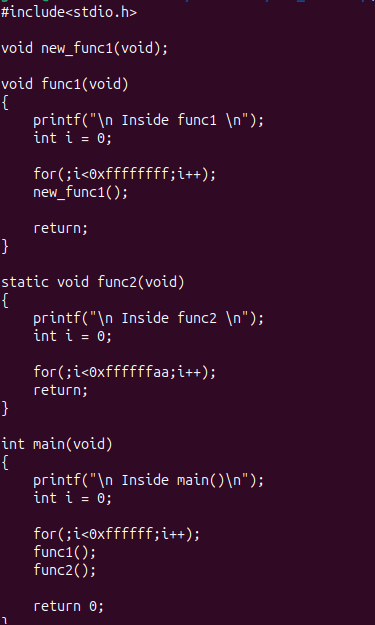
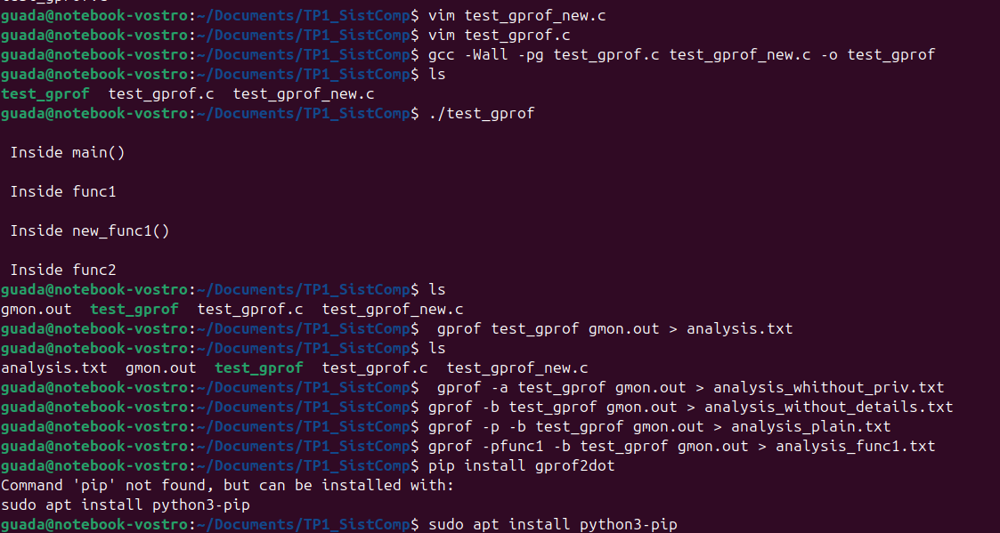
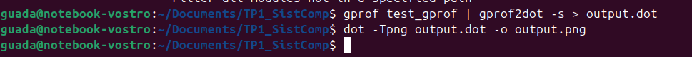
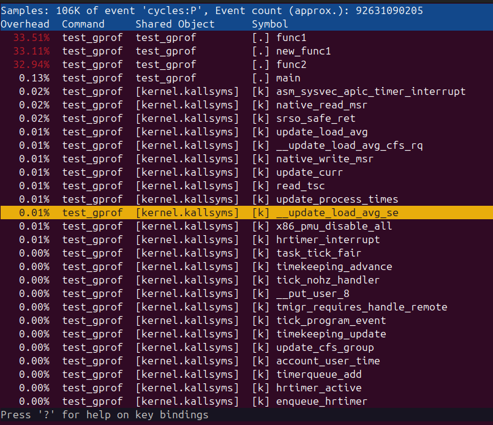
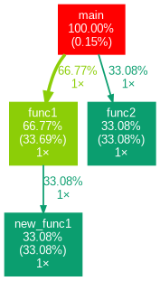

# Marco Teórico

## Introducción

El objetivo de esta tarea es poner en práctica los conocimientos sobre performance y rendimiento de los computadores. El trabajo consta de dos partes:

1. Utilizar benchmarks de terceros para tomar decisiones de hardware.
2. Utilizar herramientas para medir la performance de nuestro código.

---

## Primera Parte: Marco Teórico

### Rendimiento

El rendimiento de un sistema se define como su capacidad para completar una tarea en un tiempo determinado. Es **inversamente proporcional al tiempo empleado**: a mayor tiempo de ejecución, menor rendimiento. En las computadoras, el rendimiento está directamente relacionado con la rapidez con que ejecutan los programas, por lo que **el tiempo es una medida clave**.

---

### Comparación de Desempeño

#### Evaluación en términos relativos

Se considera que un sistema A es más eficiente que un sistema B si el primero necesita menos tiempo para ejecutar un conjunto de programas.

**Fórmulas:**
- Rendimiento A = 𝐸𝑋𝐶(𝑃𝑈_𝐴) / 𝐸𝑋𝐶(𝑃𝑈_𝐵)
- Rendimiento B = 1 / 𝐸𝑋𝐶(𝑃𝑈_𝐴)

Este método permite comparar rendimientos sin depender de diferencias absolutas.

#### Ejemplo

| Computadora | Tiempo de compilación |
|-------------|------------------------|
| A           | 10 minutos             |
| B           | 5 minutos              |

Dado que la computadora B tarda la mitad, se concluye que tiene un rendimiento superior. Esto refuerza que **a menor tiempo de ejecución, mayor eficiencia**.

---

### Factores que influyen en el Rendimiento del Procesador

- **Frecuencia de la CPU (fCPU)**: Cantidad de ciclos de reloj por segundo.
- **Período de la CPU (TCPU)**: Duración de un ciclo de reloj (inverso de la frecuencia).
- **Ciclos por instrucción (CPI)**: Promedio de ciclos necesarios por instrucción.
- **Número de instrucciones**: A mayor cantidad, mayor tiempo de ejecución.
- **Multitarea**: Capacidad de ejecutar varias tareas a la vez, aumentando la eficiencia.

**Fórmulas clave:**
- `fCPU = 1 / TCPU` 
- `TInstr = TCPU × CPI` 
- `Tprog = N_instr × CPI × TCPU` 
- `Rendimiento = 1 / Tprog = fCPU / (N_instr × CPI)`

---

### Speedup

El **Speedup** mide la mejora de rendimiento entre un sistema original y uno optimizado.

**Fórmula:**

Speedup = Rendimiento Mejorado / Rendimiento Original

---

### Eficiencia

Mientras que el speedup mide la mejora obtenida al optimizar un sistema, la eficiencia evalúa el aprovechamiento de los recursos disponibles.
Si Speedupn indica la mejora obtenida con n recursos adicionales, la eficiencia refleja el grado de utilización de esos recursos.

**Fórmula**
Eficiencia = Speedup / n

---

## Definición de Benchmark

Un **benchmark** es un conjunto de programas de prueba que mide el rendimiento de un sistema comparando tiempos de ejecución con otras máquinas.

---

### Clasificación de Benchmarks

1. **Sintéticos**: Son programas de prueba que simulan cargas reales en carga de trabajo y reparto de instrucciones. Sirven para medir el rendimineto de componentes concretos o de un computador en general. Ej: Whetstone, Dhrystone.
2. **Reducidos**: Consisten en pequeños fragmentos de código, de entre 10 y 100 líneas,  para medir características específicas. Ej: Puzzle, Quicksort.
3. **Kernel o de Núcleo**: Consiste en un fragmento de código extraído de un programa real. La parte escogida es la más representativa del programa, y por tanto, la parte que más influye en el rendimiento del sistema para ese software.
4. **Reales**: Programas reales que son ejecutados con un conjunto de datos reducido para no alargar su ejecución. Ej: SPEC (SPECint, SPECfp).

---

## Time Profiling

Los **profilers** o generadores de perfiles permiten analizar:

- Tiempo total de ejecución.
- Tiempo por función (tiempo de CPU).
- Uso de memoria.

### Técnicas principales:
- **Inyección de código**: Inserta instrucciones para medir.
- **Muestreo**: Toma muestras del estado del programa cada cierto tiempo.

---

## Imágenes

- 
- 
- 
- 
- 
- 

---

## 📌 Nota Final

Este marco teórico sirve como base para analizar el rendimiento de sistemas y aplicar herramientas prácticas en código real, buscando siempre mejorar la eficiencia y toma de decisiones en hardware y software.
