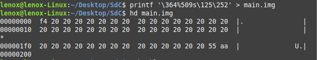
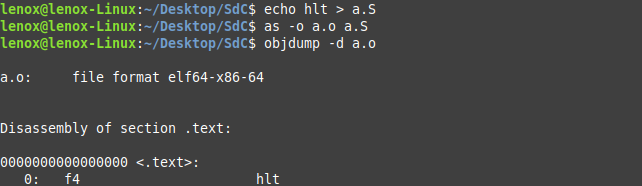
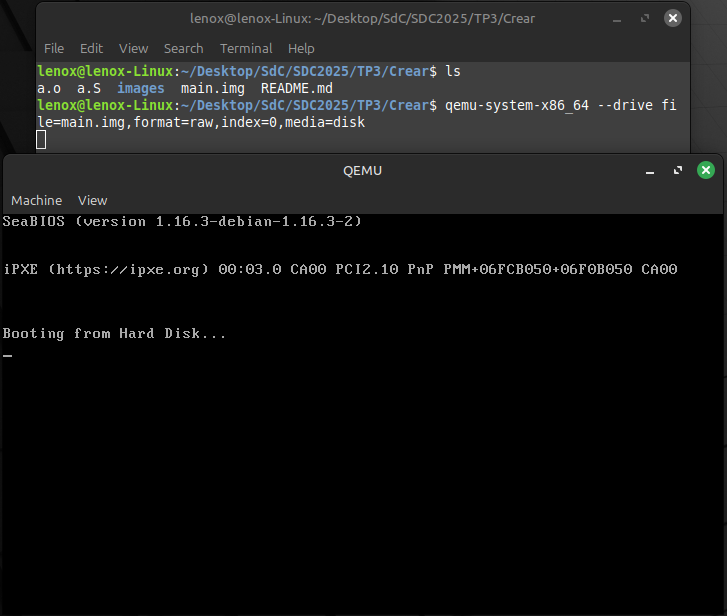
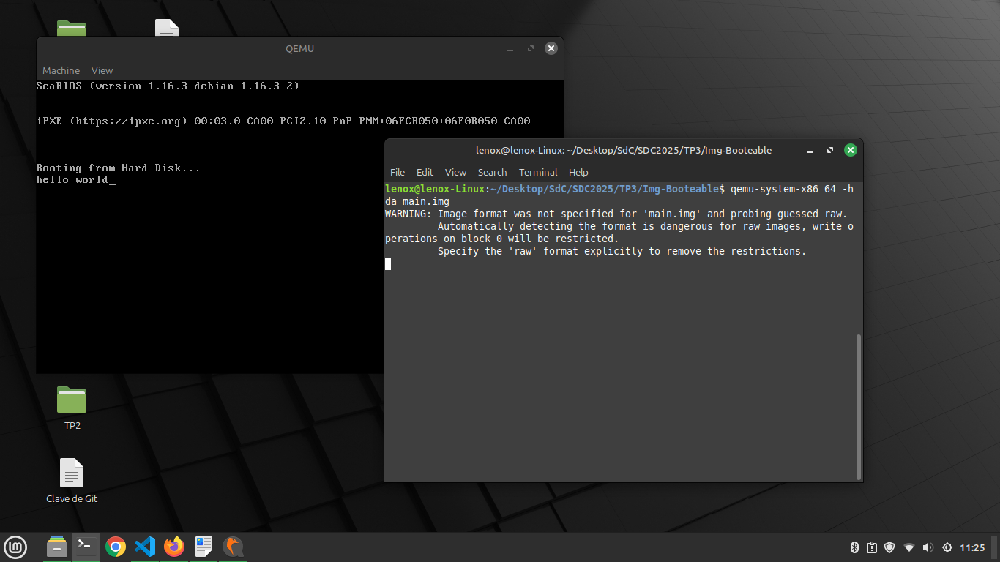

## Como Crear una imagen booteable

En la arquitectura x86 lo más simple es generar un sector de arranque (MBR) y colocarlo en un disco o imagen cruda. Para ello basta con la siguiente línea de printf:

```bash
printf '\364%509s\125\252' > main.img
```
- \364 en octal equivale a 0xF4 en hexadecimal, que es la instrucción hlt (halt).

- %509s genera 509 espacios, necesarios para completar el sector hasta el byte 510.

- \125\252 en octal son los bytes 0x55 0xAA, firma requerida para que el BIOS interprete la imagen como un MBR(Master Boot Record).



### Obtener la codificación de cualquier instrucción 
Esto quiere decir, averiguar los bytes de máquina que corresponden a una instrucción ensamblador concreta y así poder insertarlos directamente en tu imagen MBR, para ello puedes seguir estos pasos:

1. **Escribir la instrucción en ensamblador:** crea un archivo de texto con la instrucción, por ejemplo:
```bash
echo hlt > a.S
```
2. **Ensamblar:** transforma el código ensamblador en un objeto binario:
```bash
as -o a.o a.S
```
3. **Desensamblar**: muestra el código máquina (códigos hexadecimales) generado:
```bash
objdump -d a.o
```

De esta forma verás la representación en bytes (p. ej. f4 para hlt), que luego puedes incluir directamente con printf.


## Correr la imagen
Para probar la imagen en un entorno virtualizado usaremos QEMU:
```bash
sudo apt install qemu-system-x86
qemu-system-x86_64 --drive file=main.img,format=raw,index=0,media=disk
```
Esto arranca QEMU con la imagen main.img como disco de arranque.


## Correr la imagen en HW
Para ejecutar la misma imagen directamente sobre hardware real:
1. Grabar la imagen en un pendrive con dd:
```bash
sudo dd if=main.img of=/dev/sdX bs=512 count=1
```
Importante: Reemplazar /dev/sdX por el dispositivo correcto (p.ej., /dev/sdb).

2. Insertar el pendrive en la PC de destino.

3. Encender la máquina y seleccionar en el BIOS/UEFI el arranque desde USB.


## UEFI, CSME, Coreboot y más

### ¿Qué es UEFI?

UEFI (Unified Extensible Firmware Interface) es una interfaz moderna de firmware que reemplaza al tradicional BIOS. Define una interfaz entre el sistema operativo y el firmware del sistema. A diferencia del BIOS, UEFI permite una inicialización más rápida, soporta discos de más de 2 TB (con GPT), y proporciona características de seguridad avanzadas como Secure Boot.

#### ¿Cómo puedo usarlo?

Puedes desarrollar aplicaciones que corran dentro del entorno UEFI, generalmente escritas en C, utilizando las especificaciones UEFI (UEFI Specification y PI Specification). Estas aplicaciones se compilan en formato PE32+ (el mismo que ejecutables de Windows) y se cargan desde la partición EFI del disco.

Ejemplo de función UEFI que podrías llamar:
- `EFI_BOOT_SERVICES->OutputString()` permite imprimir texto en pantalla durante el arranque, útil para depurar o construir un gestor de arranque.

#### ¿Bugs de UEFI que pueden ser explotados?

Sí. Varios bugs y vulnerabilidades han sido encontrados en implementaciones de UEFI:

- “BootHole” (2020): afectó GRUB2 y permitió deshabilitar Secure Boot.
- Firmware implantado (LoJax): rootkits persistentes que infectan el firmware UEFI directamente.
- ThunderSpy: ataque contra Thunderbolt que puede aprovechar mal implementaciones UEFI.
- SMM (System Management Mode) vulnerabilidades: permiten ejecución de código con privilegios altísimos.

Estas vulnerabilidades son críticas porque el firmware UEFI tiene privilegios previos al arranque del sistema operativo y es difícil de detectar desde él.

---

### ¿Qué es CSME (Converged Security and Management Engine) y MEBx?

- **CSME**: Parte de Intel ME (Management Engine), es un subsistema de seguridad y administración presente en los procesadores Intel. Ejecuta código de bajo nivel independiente del sistema operativo. Controla funciones como TPM, Secure Boot, Intel AMT (Administración remota) y cifrado de disco. Puede seguir operando incluso con la PC apagada (estado S5), siempre que tenga energía.

- **MEBx (Management Engine BIOS Extension)**: Es la interfaz de configuración accesible durante el arranque (usualmente con Ctrl+P) para modificar parámetros de Intel ME, como contraseñas, direcciones de red para AMT, etc.

Estos sistemas han sido criticados por representar un "black box" con capacidades de backdoor si se explotan.

---

### ¿Qué es Coreboot?

Coreboot es un firmware libre y de código abierto que reemplaza el BIOS/UEFI propietario. Su objetivo es inicializar el hardware y luego pasar el control al sistema operativo o un payload (como SeaBIOS, Tianocore, Linux, etc.).

#### ¿Qué productos lo incorporan?

- Chromebooks (por Google)
- Algunas placas base de Purism, System76, Lenovo (con modificaciones)
- Servidores y dispositivos embebidos de empresas como 3mdeb, Insurgo y más.

#### Ventajas:

- Código abierto y auditable (mayor seguridad).
- Arranque ultrarrápido (milisegundos frente a segundos).
- Elimina componentes privativos como Intel ME en algunos casos ("me_cleaner").
- Muy modular: puedes construir solo los drivers y funciones que necesitas.

---

## Crear un Bootloader "Hello World" en Ensamblador
Además del ejemplo con `printf`, podemos escribir manualmente un pequeño bootloader en ensamblador que imprima "hello world" utilizando la BIOS. Este ejemplo se compone de tres archivos: el código en ensamblador, un script de linker y los comandos para compilar y ejecutar.

---

1. **Escribir el código en ensamblador (main.S)**

Creamos un archivo llamado `main.S` con el siguiente contenido:

```asm
.code16
    mov $msg, %si        # Cargar la dirección del mensaje en SI
    mov $0x0e, %ah       # Función de teletipo (modo BIOS, int 0x10)

loop:
    lodsb                # Cargar siguiente byte apuntado por SI en AL
    or %al, %al          # Verificar si es cero (fin de cadena)
    jz halt              # Si es cero, saltar a halt
    int $0x10            # Llamar a la BIOS para imprimir el carácter
    jmp loop             # Repetir

halt:
    hlt                  # Detener ejecución

msg:
    .asciz "hello world" # Mensaje a imprimir (terminado en 0)
```
Este código imprime la cadena carácter por carácter usando interrupciones BIOS.

---

2. **Crear un script de linker (link.ld)**

Creamos el archivo link.ld con:

```asm
SECTIONS
{
  /* El BIOS carga el MBR en la dirección 0x7C00 */
  . = 0x7c00;

  .text : {
    _start = .;
    *(.text)
    /* Firma MBR requerida por BIOS (en bytes 510-511) */
    . = 0x7dfe;
    SHORT(0xAA55)
  }
}
```
Este script indica al linker dónde colocar el código (en 0x7C00) y agrega la firma MBR 0xAA55 al final.

3. **Compilar, linkear y ejecutar**

Usamos los siguientes comandos:

```bash
as -g -o main.o main.S
ld --oformat binary -o main.img -T link.ld main.o
qemu-system-x86_64 -hda main.img
```
- El primer comando ensambla el código fuente.
- El segundo genera una imagen binaria en formato plano (main.img).
- El tercero arranca la imagen en QEMU como si fuera un disco.

### Ejecutar en hardware real

1. Conecta un pendrive y localiza su ruta con:
```bash
lsblk
```
Por ejemplo, podría aparecer como /dev/sdb.

2. Escribe la imagen al pendrive 
```bash
sudo dd if=main.img of=/dev/sdb bs=512 count=1
```
3. Inserta el pendrive en la PC destino, accede al menú de arranque (Boot Menu o BIOS/UEFI) y selecciona el dispositivo USB como medio de arranque.

4. Si todo es correcto y el hardware es compatible con BIOS (no solo UEFI), verás impreso en pantalla: "hello world"


Nota: Como no se pudo correr la imagen en hardware real lo implementamos en QEMU donde funciono correctamente:

