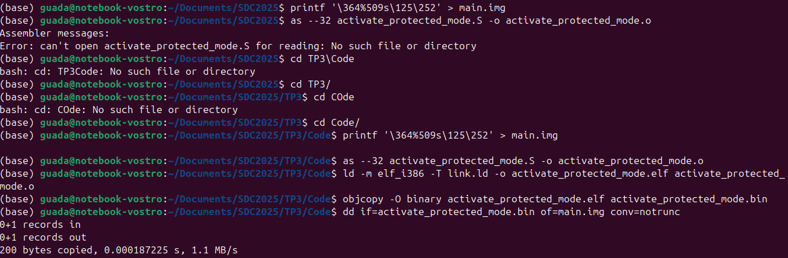
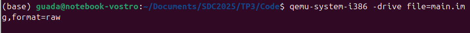
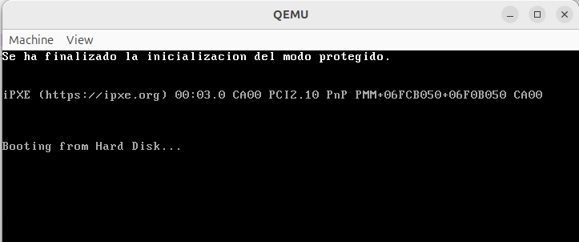
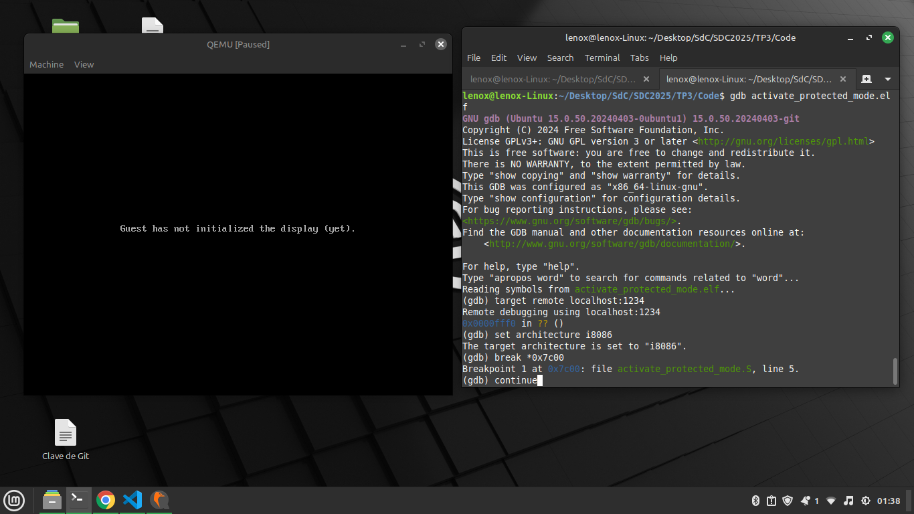
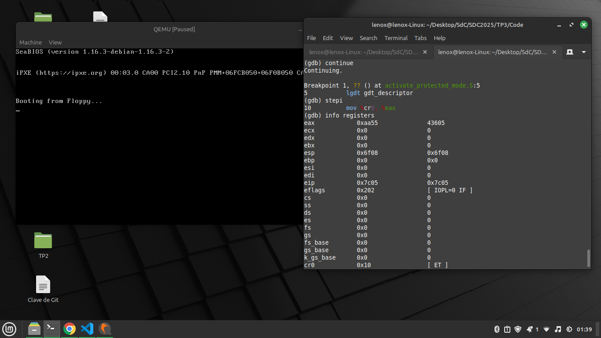
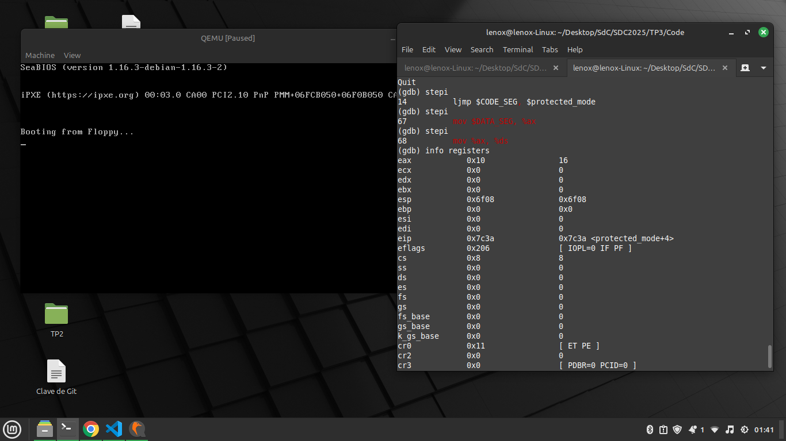
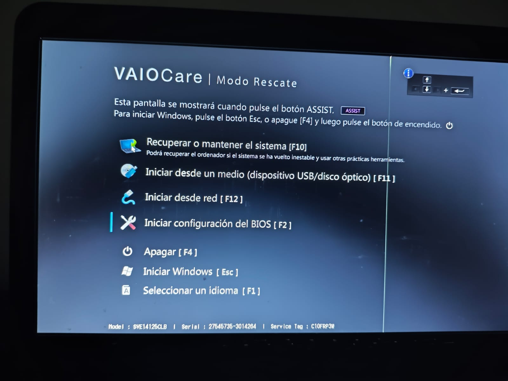
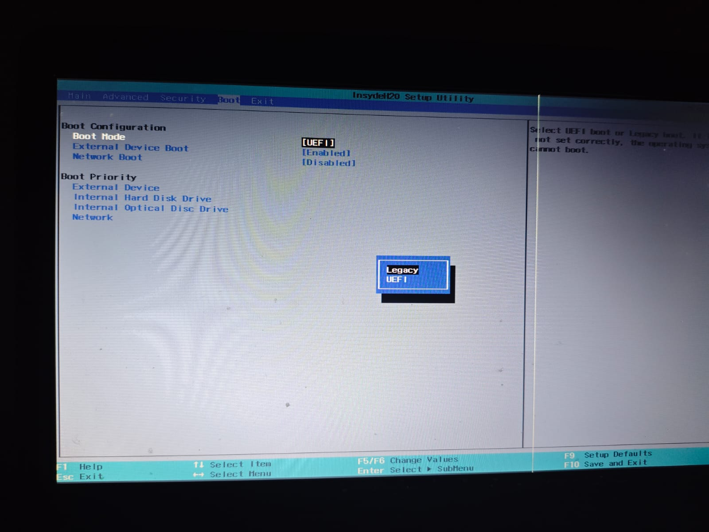
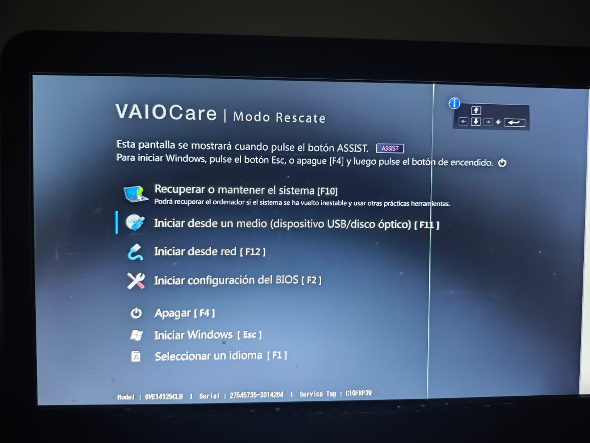

# Sistemas de Computación 2025 - Modo Protegido en x86

## Introducción

Este proyecto tiene como objetivo demostrar la transición del modo real al modo protegido en la arquitectura x86.  
El trabajo práctico fue realizado sobre un entorno Linux.

La implementación incluye:
- Creación de una imagen de arranque (`main.img`).
- Configuración de la GDT (Global Descriptor Table).
- Activación del modo protegido mediante manipulación del registro `CR0`.
- Ejecución y depuración del código en QEMU.

---

## Estructura del proyecto

```
/home/Documents/SDC2025/TP3/
|
|-- Code/
|    |-- activate_protected_mode.S
|    |-- link.ld
|    |-- main.img
|    |-- activate_protected_mode.o
|    |-- activate_protected_mode.elf
|    |-- activate_protected_mode.bin
|
|-- Images/
|    |-- image1.png
|    |-- image2.png
|    |-- image3.png
```

---

## Instrucciones para compilar y ejecutar

1. Crear la imagen base:
```bash
printf '\364%509s\125\252' > main.img
```

2. Compilar el archivo assembly:
```bash
as --32 activate_protected_mode.S -o activate_protected_mode.o
```

3. Linkear el objeto generado usando el linker script:
```bash
ld -m elf_i386 -T link.ld -o activate_protected_mode.elf activate_protected_mode.o
```

4. Convertir el ejecutable a formato binario:
```bash
objcopy -O binary activate_protected_mode.elf activate_protected_mode.bin
```

5. Insertar el código en la imagen:
```bash
dd if=activate_protected_mode.bin of=main.img conv=notrunc
```

6. Ejecutar la imagen en QEMU:
```bash
qemu-system-i386 -drive file=main.img,format=raw
```

7. Para depuración con GDB:
```bash
qemu-system-i386 -fda main.img -boot a -s -S -monitor stdio
```
En otra terminal:
```bash
gdb gdb activate_protected_mode.elf
(gdb) target remote localhost:1234
(gdb) set architecture i8086
(gdb) break *0x7c00
(gdb) continue
```

---

## Capturas de pantalla

Imágenes capturadas durante la ejecución del entorno:

- 
- 
- 

---

### Imágenes capturadas del proceso de Depuración con GDB y llamadas a BIOS

1. Luego de arrancar QEMU con el stub de GDB, lanzamos GDB sobre el ELF y ponemos un break:



2. Continuar hasta mov %cr0, %eax


En 0x7c05, CR0 = 0x10 (solo ET=1), confirmando que aún estamos en modo real.

3. Preparar EAX = CR0 | 1


Antes de mov %eax,%cr0, EAX = 0x11, listo para activar PE.

4. Ejecutar mov %eax,%cr0 + ljmp


Tras ljmp, CR0 = 0x11 (PE=1) y CS = 0x08, confirmando modo protegido activo.

5. Recarga de segmentos de datos


DS, ES, FS, GS y SS recargados con el selector 0x10.

6. Configurar stack y preservación de registros


Se monta un nuevo stack en 0x7000 y se preservan registros para la impresión.

7. Impresión en VGA
Comprobamos punteros y volvamos memoria de vídeo


ECX apunta a “message” y EDX a 0xB8000.
Memoria 0xB8000 mostrando ASCII + atributo, confirmando la impresión.

8. Conclusión
Con esta depuración hemos verificado:
- Preparación de la GDT con lgdt.
- Activación de PE en CR0 y transición a modo protegido.
- Recarga de segmentos (CS, DS, ES, FS, GS, SS).
- Configuración de stack y preservación de registros.
- Impresión en memoria de vídeo desde modo protegido.


## Respuestas teóricas

**¿Qué es un Linker?**  
Un linker es una herramienta que combina uno o más archivos objeto (.o) generados por el compilador en un solo archivo ejecutable o binario. Resuelve referencias a funciones o variables entre los distintos archivos.

**¿Qué hace el Linker?**  
- Asigna direcciones de memoria a las instrucciones y datos.
- Resuelve direcciones de etiquetas.
- Agrupa las diferentes secciones (.text, .data, .bss) de manera coherente.

**¿Qué es la dirección en el script del linker?**  
La dirección que se fija (en este caso `0x7C00`) indica en qué posición de memoria RAM debe cargarse el código. Es necesaria para que el sistema sepa desde dónde comenzar a ejecutar instrucciones.

**¿Por qué es necesaria la dirección?**  
Porque el BIOS carga el sector de arranque en `0x7C00` y empieza la ejecución desde allí. Si el código estuviera preparado para otra dirección, fallaría.

**Comparación de `objdump` y `hd`:**  
- `objdump` muestra el contenido de un binario de forma entendible (ensamblador).
- `hd` (hexdump) muestra directamente los bytes hexadecimales.

Ambas herramientas permiten verificar dónde se colocó el programa en la imagen (`0x7C00`).

**¿Para qué se utiliza `--oformat binary`?**  
Se utiliza para generar un archivo binario puro (sin cabeceras de formato ELF u otros) que pueda ser cargado directamente por el BIOS o un emulador.

---

## Prueba en Hardware Real

1. Limpiar pendrive:

```bash
sudo dd if=/dev/zero of=/dev/sdb bs=1M
```
2. Grabar main.img:

```bash
sudo dd if=main.img of=/dev/sdb bs=512 conv=notrunc
sudo sync
```

3. Verificar firma 0x55AA:
```bash
sudo hexdump -C -n 512 /dev/sdb | tail -n 2
```

4. Para probarlo en Hardware real primero debemos confirgurar el mismo 
- 4a

Entramos a la configuracion de la BIOS

- 4b

Configuramos el Boot Mode en Legacy

5. Iniciamos desde el dispositivo USB


Luego:

```markdown
[Arranque desde Pendrive](./Images/ArranquePendrive.mp4)
```

Arranque real desde pendrive, mensaje impreso y CPU reiniciado tras finalizar.

**Con esto se demostro:**
- La transición de modo real a modo protegido en x86 mediante:
   - Configuración de la GDT y activación de PE en CR0.
   - Salto a código de 32 bits y recarga de segmentos.
   - Impresión en VGA.

## Ultimo desafio
### preguntas teoricas:
1) **¿Qué sucede al intentar escribir en un segmento de solo lectura?**
* Si intentamos escribir en un segmento de solo lectura, el procesador generara una excepcion de proteccion de memoria. Esto es parte del modo protegido que impide el acceso no autorizado a memoria de solo lectura o solo de ejecucion. 

2) **¿Qué debería suceder a continuación?**
* Segun la teoria del modo protegido, cuando se intenta escribir en un segmento de solo lectura, se genera una excepción de acceso a memoria (generalmente 0x0D, que indica "General Protection Fault"). El sistema operativo o el entorno de ejecución debería capturar esta excepción y gestionarla adecuadamente.

3) **¿Con qué valor se cargan los registros de segmento en modo protegido? ¿Por qué?**

* En el modo protegido, los registros de segmento, como CS, DS, SS, se cargan con un valor que hace referencia a un descriptor de segmento específico en la GDT. En este desafio, el valor de CS se carga con el selector del segmento de código, mientras que DS se carga con el selector del segmento de datos.
Los valores de los registros de segmento determinan los permisos y la base de cada segmento. En el caso del segmento de datos, configuramos los permisos para que sea solo lectura, lo que evita que se escriba en él.

### Verificacion con gdb


## Referencias

- [Clase teórica de modo protegido](https://fcefyn.aulavirtual.unc.edu.ar/)
- [Documentación OSDev](https://wiki.osdev.org/Protected_Mode)
- [Ejemplos bare-metal x86](https://github.com/cirosantilli/x86-bare-metal-examples)

---

Trabajo práctico realizado para la materia **Sistemas de Computación 2025**.


