# Marco Teórico

## ¿Qué es el Kernel?

El kernel, también conocido como núcleo, es el corazón del sistema operativo. Es esa capa intermedia que se encarga de que el software pueda usar el hardware sin tener que lidiar con sus complejidades. Está presente en cualquier sistema operativo moderno, desde Windows hasta Linux, siendo este último uno de los más conocidos por ser de código abierto.

### Función del Kernel

El kernel es como un "organizador" que reparte los recursos del hardware (como CPU, memoria o dispositivos) entre los programas que los necesitan. Se encarga de decidir quién usa qué, cuánto y cuándo. También es el guardián que evita que un programa interfiera con otro o acceda a partes del sistema que no debería. Esto lo hace crucial para la seguridad y estabilidad general.

### ¿Que son los modulos del kernel?

En el caso de Linux, el kernel es modular. Esto significa que se pueden agregar o quitar funcionalidades sin tener que reiniciar el sistema ni recompilar todo el núcleo. Por ejemplo:

* Agregar drivers para nuevas tarjetas gráficas.
* Habilitar sensores de temperatura del sistema.
* Activar soporte para una nueva placa de red.

Estos módulos se cargan o descargan según se necesiten, lo que permite adaptar el sistema al hardware disponible de forma flexible y eficiente.

---

# Desarrollo

Para trabajar con el kernel y sus módulos, vamos a usar un entorno Linux. Es importante tener instalado el código fuente del kernel o los encabezados (headers). 

## Primeros Pasos

1. **Instalar las herramientas básicas:**

```bash
$ sudo apt-get install build-essential 
```

Esto instala lo necesario para compilar programas en Linux, como `gcc`, `make` y herramientas para trabajar específicamente con el kernel. 

2. **Instalar el código fuente del kernel:**

```bash
$ sudo apt-get install linux-source
```

Con esto se tiene lo necesario para compilar neustros propios módulos del kernel.


## Comandos Clave para Manejo de Módulos


El trabajo tiene una carpeta llamada "module", donde hay dos archivos inicialmente, un Makefile que se encarga de compilar el módulo y un archivo .c que es el código del módulo.

1. **`make clean`**

   * Limpia los archivos de compilaciones anteriores.

2. **`make all`**

   * Compila el módulo, generando un archivo `.ko`.

3. **`ls -lha`**

   * Muestra información sobre los archivos generados.


[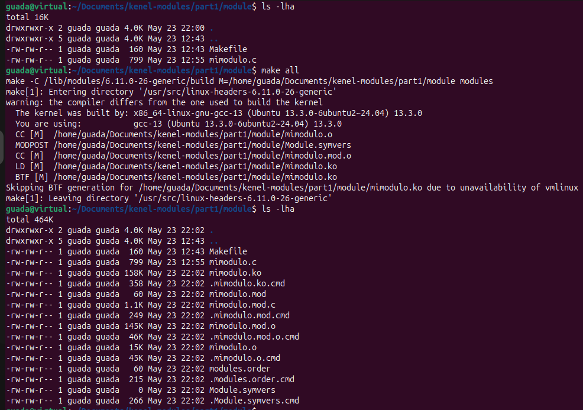]()


Una vez compilado el módulo, se puede ver el archivo .ko en la carpeta "module".


4. **`modinfo mimodulo.ko`**

   * Muestra detalles del módulo: autor, licencia, dependencias, etc.

5. **`sudo insmod mimodulo.ko`**

   * Carga el módulo en el kernel.

6. **`sudo rmmod mimodulo.ko`**

   * Descarga el módulo del kernel.

7. **`lsmod`**

   * Muestra todos los módulos actualmente cargados.

 


 [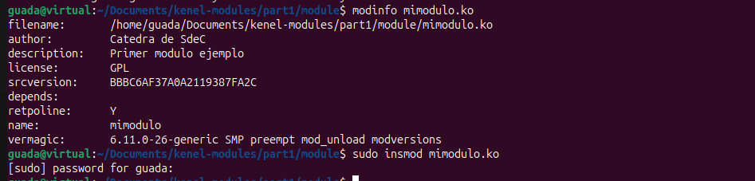]()


Finalmente, se puede ver el mensaje de que el módulo se cargó correctamente cuando lo agregamos al kernel. Y cuando lo eliminamos, se ve el mensaje de que se descargó correctamente.


8. **`dmesg`**

   * Visualiza los mensajes generados por el kernel.

 [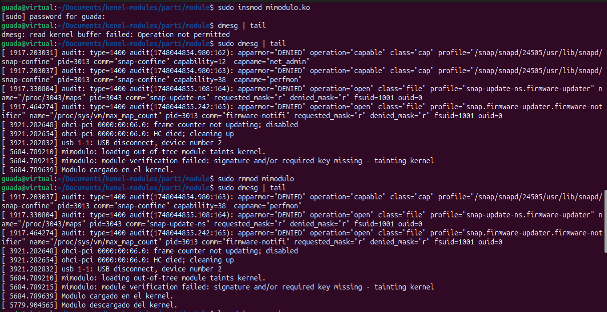]()


> **Advertencia: Problemas con Secure Boot**
>
> Algunos módulos pueden fallar al cargarse si Secure Boot está activado. Para solucionarlo:
>
> 1. Entra al BIOS/UEFI.
> 2. Busca y desactiva "Secure Boot".
> 3. Guarda y reinicia.
> 4. Prueba de nuevo a cargar el módulo.

### Nuestro Módulo de Ejemplo

Este módulo solo imprime un mensaje con `printk` cuando se carga. Aunque simple, es muy útil para practicar cómo compilar, insertar y depurar módulos.

## ¿Qué módulos están disponibles?

Para ver los módulos del kernel instalados:

```bash
ls -l /lib/modules/$(uname -r)/kernel
```

[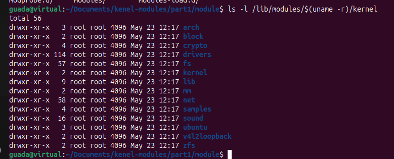]()
 


# DESAFIO #1


## ¿Qué es CheckInstall?

Cuando instalás software en Linux desde el código fuente, normalmente usás comandos como `./configure`, `make`, y `make install`. El problema de este enfoque es que el sistema no tiene forma de saber qué archivos se instalaron ni cómo desinstalarlos fácilmente después.

Ahí entra **CheckInstall**, una herramienta muy útil que resuelve este problema: permite registrar esa instalación como si fuera un paquete `.deb` o `.rpm`, dependiendo de la distribución. De esta manera, podés gestionar ese software con tu gestor de paquetes habitual (como `dpkg` en Debian/Ubuntu), hacer actualizaciones más limpias y desinstalaciones más seguras.

Es especialmente útil si estás desarrollando software propio o compilando programas que todavía no están en los repositorios oficiales.

## Crear un paquete con CheckInstall: Ejemplo con Hello World

1. **Se instala CheckInstall:**

```bash
sudo apt-get update
sudo apt-get install checkinstall
```

2. **Se escribe el código fuente:**
   Archivo `hello.c`:

```c
#include <stdio.h>
int main() {
    printf("HELLO WORLD!\n");
    return 0;
}
```

3. **Se compila el código fuente:**

```bash
gcc -o hello hello.c
```

4. **Se crea un script de instalación:**
   Archivo `install.sh`:

```bash
#!/bin/bash
cp hello /usr/local/bin/
```

5. **Se hace ejecutable el script e instalá con CheckInstall:**

```bash
chmod +x install.sh
sudo checkinstall --pkgname=hello-world --pkgversion=1.0 --backup=no --deldoc=yes --default ./install.sh
```

La salida de este comando es la siguiente:

[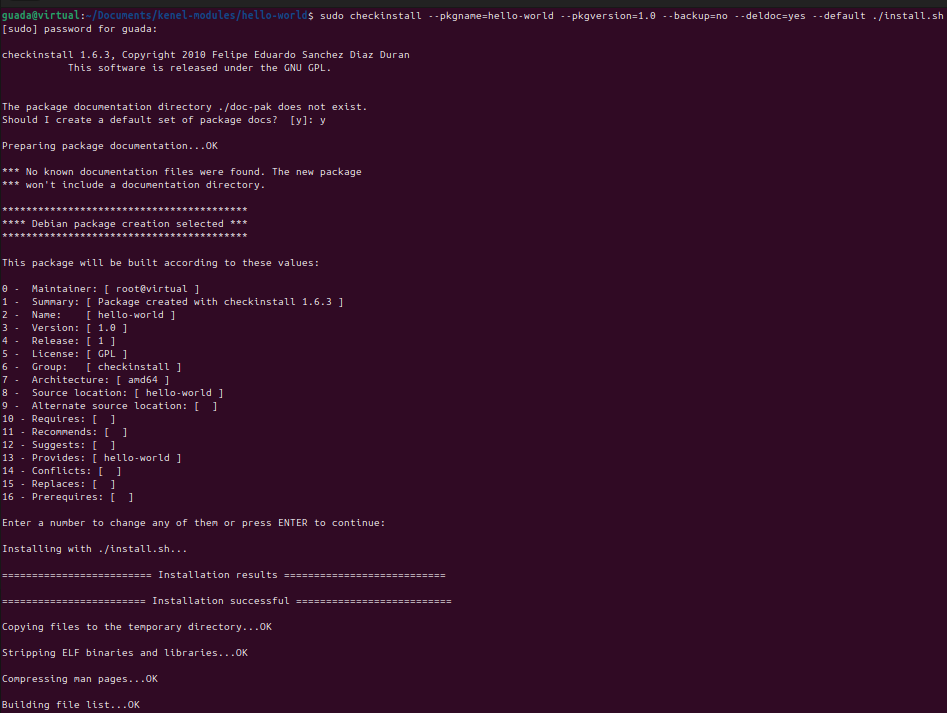]()


Esto generará un archivo `.deb` que se instalará en tu sistema y que luego podés remover con:

```bash
sudo dpkg -r hello-world
```
 
[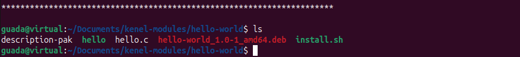]()


## Seguridad en los Módulos del Kernel

Cuando trabajamos con módulos del kernel, la seguridad es un aspecto crítico. Cargar un módulo es darle acceso directo al corazón del sistema, por eso es fundamental garantizar su integridad y autenticidad. Una forma de hacerlo es mediante la firma digital de módulos.

### ¿Por qué firmar un módulo?

Firmar un módulo permite verificar que no ha sido alterado desde que fue creado. Es especialmente importante si tenés Secure Boot activado, ya que éste bloquea la carga de módulos no firmados como medida de protección ante software malicioso.

### Firmado de Módulos: Pasos

1. **Crear un certificado SSL:**

Usá OpenSSL y un archivo `.cnf` que describe los atributos del certificado. Ejemplo básico:

```ini
[ req ]
distinguished_name = req_distinguished_name
x509_extensions = v3
prompt = no

[ req_distinguished_name ]
countryName = AR
stateOrProvinceName = Cordoba
localityName = Cordoba
organizationName = UNC
commonName = FirmaDeModulo

[ v3 ]
basicConstraints = CA:FALSE
keyUsage = digitalSignature
extendedKeyUsage = codeSigning
```

Generá las claves:

```bash
openssl req -config openssl.cnf -new -x509 -newkey rsa:2048 -nodes -days 36500 -outform DER \
-keyout MOK.priv -out MOK.der
```

2. **Registrar la clave en el sistema (enroll):**

```bash
sudo mokutil --import MOK.der
```

Esto activa un proceso de confirmación al reiniciar desde el entorno UEFI.

3. **Firmar el módulo compilado:**

```bash
sudo /usr/src/linux-headers-$(uname -r)/scripts/sign-file sha256 MOK.priv MOK.der mimodulo.ko
```

4. **Verificar la firma:**

```bash
modinfo mimodulo.ko
```

### Medidas adicionales de seguridad

Firmar módulos es sólo una parte. Algunas estrategias extra para fortalecer la seguridad del kernel incluyen:

* **Prevención de desbordamientos de búfer (buffer overflow):** mitigando vulnerabilidades comunes.
* **Protección de memoria crítica:** evitando escrituras no autorizadas en estructuras internas del kernel.
* **Uso de herramientas como LKRG:** para detectar modificaciones del kernel en tiempo real.
* **Políticas de acceso:** como SELinux o AppArmor para restringir lo que pueden hacer usuarios y procesos.
* **Randomización de memoria (ASLR):** moviendo aleatoriamente datos sensibles en la RAM para prevenir ataques.

---

# DESAFIO #2

Vamos a comparar un modulo de kernel con nuestro modulo y vamos a identificar las diferencias.

## ¿Qué diferencias se pueden observar entre los dos modinfo ? 

```bash
modinfo mimodulo.ko > modInfo/mimoduloInfo.txt
modinfo /lib/modules/$(uname -r)/kernel/crypto/des_generic.ko.zst > modInfo/genericInfo.txt
```
Los archivos los guardamos en `module/modInfo`.

[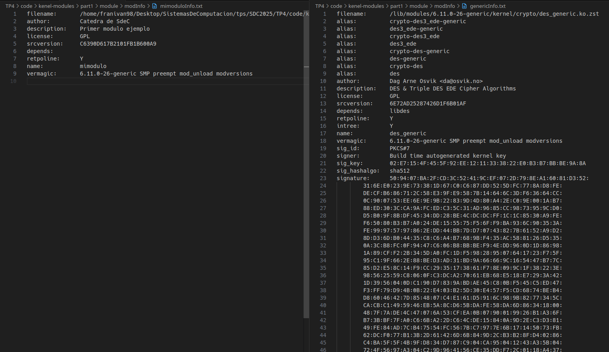]()

Se puede ver que `mimodulo.ko` es un ejemplo sencillo sin funcionalidades reales, sin dependencias ni firma digital. No esta comprimido ni forma parte de un arbol oficial de kernel.

En cambio `des_generic.ko.zst`es un modulo oficial del kernel ubicado en `lib/modules/`, implementa cifrado DES/3DES, tiene dependencias, esta comprimido, firmado digitalmente y marcado como parte del arbol del kernel.

## ¿Qué divers/modulos estan cargados en sus propias pc?

vamos a trabajar en el directorio `TP4/modulos`.
Aqui van a estar cargados 3 archivos con los modulos cargados en cada pc.

# (FALTA COMPLETAR. CARGUEN SUS MODULOS CON ESTO: `lsmod > PC_nombre_modulos.txt`)

## ¿cuales no están cargados pero están disponibles? que pasa cuando el driver de un dispositivo no está disponible. 

Para poder ver todos los modulos disponibles de nuestro sistema, vamos a usar el siguiente comando:

```bash
find /lib/modules/$(uname -r)/kernel -type f -name "*.ko*" > PC_Franco_modulos_disponibles.txt
```
si abrimos el archivo, vamos a ver que tenemos disponibles un total de 6589 modulos, como drivers para camaras, controladores de red, sonido, etc. Cargados actualmente tenemos 158, como pudimos ver en el item anterior.

[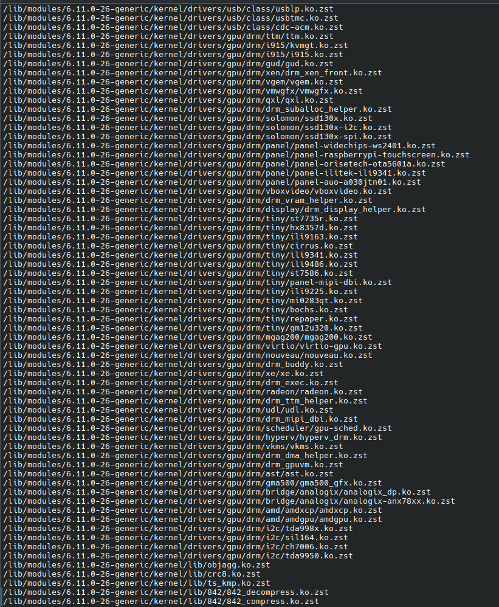]()

Si un driver o modulo no esta disponible en el sistema (ni cargado ni instalado), el hardware correspondiente no funcionará. En estos casos, el sistema puede mostrar errores en `dmesg`, `journalctl`, o el hardware directamente no aparecera en herramientas como `lspci`, `lsusb`o `ifconfig`.

Ejemplos de consecuencias:
* Una tarjeta wifi no funcionara si falta su modulo.
* UN puerto USB 3.0 puede no tener la velocidad maxima si falta el modulo `xhci_hcd`.
* UN sistema virtualizado no podra acceder al disco si falta el driver de almacenamiento virtual.

## Correr hwinfo en una pc real con hw real y agregar la url de la información de hw en el reporte. 

hwinfo es una herramienta que permite detectar y mostrar informacion detallada del hardware de una computadora. Escanea todos los componentes del sistema: CPU, memoria, discos, tarjetas, graficas, red, sonido, etc.

para usarlo, primero lo vamos a instalar:
```bash
sudo apt install hwinfo
```

Para ver un resumen rapido del sistema podemos usar el siguiente comando:

```bash
hwinfo --short
```
[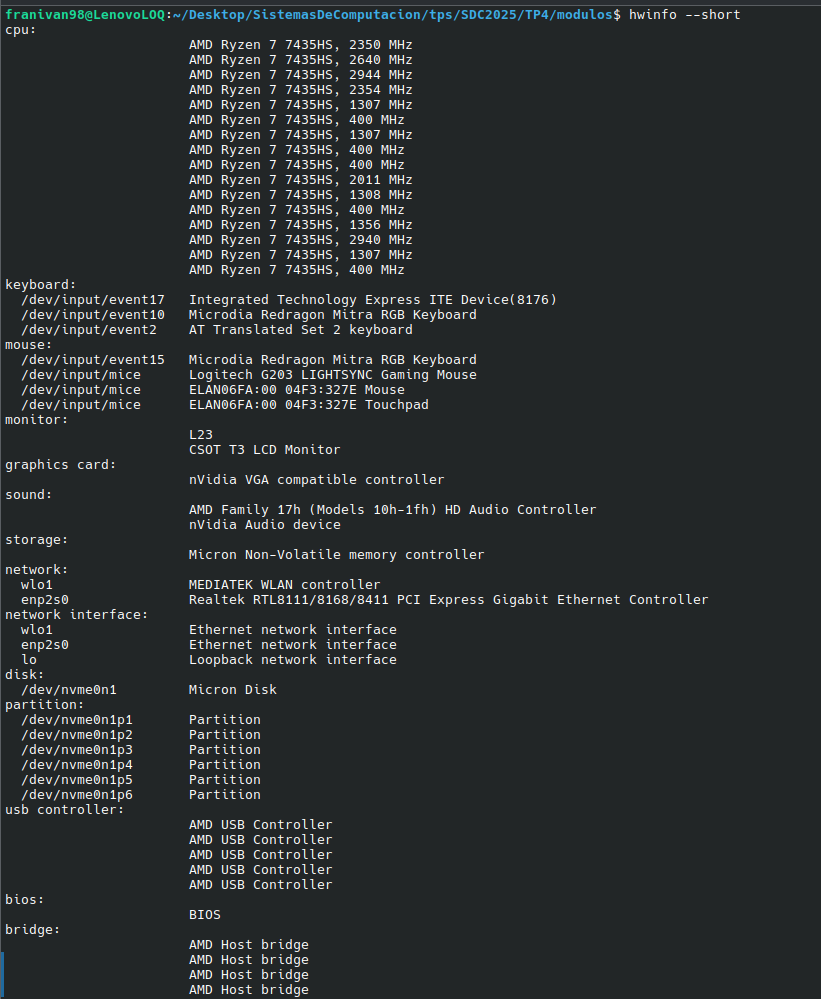]()

y por ultimo, para guardar toda nuestra informacion usaremos lo siguiente (seguimos en el directorio modulos)

```bash
hwinfo > hwinfo_Franco.txt
```
---

## ¿Qué diferencia existe entre un módulo y un programa?
Las diferencias entre un modulo y un programa se puede dividir en varias partes, primero:

#### a) Lugar de ejecución y privilegios

 - Programa de espacio de usuario (user‐space):

   - Se compila y ejecuta como un proceso normal con la función main()

   - Corre en un modo de privilegios restringidos (ring 3 en arquitecturas x86), protegido por el kernel

   - Si falla (por ejemplo, accede a memoria inválida), el kernel le envía una señal (habitualmente SIGSEGV) y muere ese proceso sin afectar a otros procesos ni al kernel

 - Módulo del kernel (kernel‐space):

   - Es un fragmento de código que se inserta dinámicamente dentro del propio kernel, a través de las funciones module_init() y module_exit(), en lugar de main() 

   - Corre con máximos privilegios (ring 0): cualquier fallo (null pointer, UAF, etc.) puede provocar un kernel panic y reiniciar o dejar inutilizable el sistema

   - Amplía la funcionalidad del kernel (drivers de hardware, sistemas de archivos, subsistemas de red, etc.) sin necesidad de recompilar o reiniciar todo el núcleo

#### b) API y funciones disponibles

 - Para un programa (user‐space):
   - Puede usar la librería estándar de C (libc) y todas las llamadas a sistema (syscalls) que proporciona el kernel: open(), read(), write(), malloc(), printf(), fork(), etc

   - Tiene acceso a llamados al sistema a través de envoltorios proveidos por libc

 - Para un módulo del kernel (kernel‐space):

   - Solo dispone de las funciones exportadas por el propio kernel, que aparecen listadas en /proc/kallsyms. Por ejemplo:

     - Para imprimir mensajes: printk() (no printf)

     - Para asignar memoria: kmalloc(), kfree()

     - Para registrar puntos de entrada/salida de dispositivos: register_chrdev(), unregister_chrdev()

     - Funciones de sincronización: spin_lock(), mutex_lock(), etc

  - No puede invocar funciones de libc ni ninguna llamada al sistema directamente: si quisieran leer un fichero, deberían reimplementar la lógica usando VFS interno, no fopen()

#### c) Ciclo de vida

 - Programa:
   1. El compilador genera un ejecutable ELF con main()

   2. El usuario lo invoca (./mi_programa)

   3. El loader (binfmt) carga el binario en memoria y salta a main()

   4. Al terminar main(), retorna al kernel y finaliza el proceso

 - Módulo:

   1. Se compila como objeto relocable (.ko) con make modules

   2. El usuario (o un udev rule) ejecuta insmod mimodulo.ko o modprobe mimodulo

   3. El kernel carga simbólicamente el código en su propio espacio e invoca la función marcada con module_init()

   4. El módulo permanece en memoria hasta que alguien ejecute rmmod mimodulo, momento en el cual el kernel llama a la función module_exit()

   5. Cuando el módulo se descarga, libera sus recursos

   6. Si algo va mal dentro del módulo, el kernel no “mata solo el módulo”: se produce un panic o corrompe estructuras críticas
---

## ¿Cómo puede ver una lista de las llamadas al sistema que realiza un simple helloworld en C?
Para “ver” las syscalls ejecutadas por un programa de usuario, la herramienta estándar es strace

#### Pasos:

   1. **Escribir y compilar un simple “Hello World”**
   ```init
      /* hello.c */
   #include <stdio.h>
   int main(void) {
       printf("HELLO WORLD\n");
       return 0;
   }
   ```
   compilamos con:

   ```bash
   gcc -Wall -o hello hello.c
   ```

   2. **Ejecutar con strace**

   - Para ver cada llamada y sus argumentos en tiempo real:
   
   ```bash
   strace -tt ./hello
   ```
   Aquí el flag -tt antepone la marca de tiempo a cada syscall. Por lo tanto veremos esto:
   
[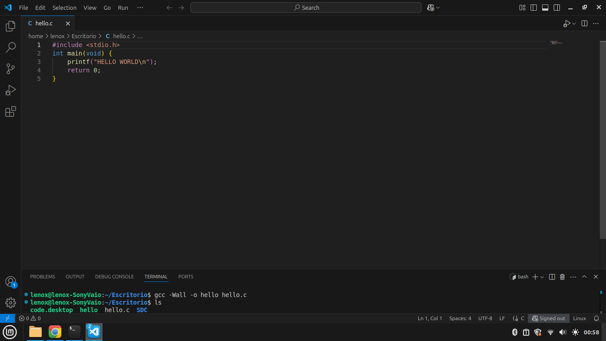]()

[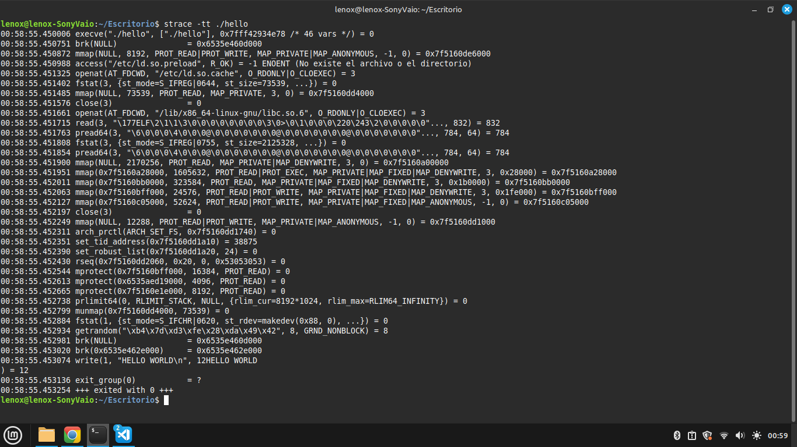]()
Si nos fijamos únicamente en la “lógica” de nuestro `main()`, vemos que el momento en que realmente imprimimos “HELLO WORLD” corresponde a:
```bash
write(1, "HELLO WORLD\n", 12) = 12
exit_group(0)             = ?
```
Sin embargo, justo antes de eso, y a partir de que el loader arranca el binario, aparecen múltiples llamadas al sistema (execve, brk, mmap, openat, fstat, mprotect, arch_prctl, set_tid_address, getrandom, etc.) que corresponden a:
1. Cargar el ejecutable en memoria y resolver dependencias (libc, ld-so).
2. Reservar y proteger regiones de heap/stack.
3. Inicializar estructuras internas (por ejemplo, FS para hilos).
4. Leer datos de bibliotecas dinámicas y generar la semilla de “rand” en la libc.
5. Comprobar descriptores de entrada/salida.

Solo una vez listo todo el entorno, la libc invoca internamente `write` para imprimir el mensaje y `exit_group` para terminar el proceso. Por tanto, aunque—desde el punto de vista del “Hello World” en C lo "importante" sea write + exit_group, vale la pena destacar que hay muchas otras syscalls previas que realiza el runtime. 

---

## ¿Qué es un segmentation fault? ¿Cómo lo maneja el kernel y cómo lo hace un programa?
Un segmentation fault (o segfault) ocurre cuando un proceso intenta acceder a una dirección de memoria a la que no tiene permitido leer/escribir

Por ejemplo: 
```bash
int *p = NULL;
*p = 42;    // Esto invoca un acceso inválido a 0x0 --> segfault
```
El hardware genera una excepción de página (page fault) al detectar que esa dirección no está mapeada en su espacio de direcciones, o que no tiene permisos de escritura/lectura

El **Kernel** lo maneja de la siguiente manera:

1. Cuando se produce un acceso inválido la CPU dispara una excepción y el control pasa al manejador de fallos de página del kernel
2. El kernel revisa por qué ocurrió el fallo:
  - Si la dirección pertenece a un mapeo válido (p.ej. intentar escribir sobre un área en modo “solo lectura”), puede traducirse en un SIGSEGV con código SEGV_ACCERR o similar
  - Si la dirección no existe en la tabla de páginas (p.ej. puntero nulo), se envía un SIGSEGV al proceso responsable
  - En caso de intentar escribir fuera de la memoria asignada, se envía también SIGSEGV.
3. El kernel no “mata inmediatamente” al proceso, en realidad encola la señal SIGSEGV para el proceso. Si el proceso no la captura, el kernel lo termina y —por defecto— se genera un core dump (archivo de volcado de memoria). 

El **Programa** lo maneja diferente:

 - Por defecto:
   - Si el proceso no ha definido un manejador personalizado para SIGSEGV, al recibirlo el kernel detiene la ejecución del programa y genera un archivo core (salvo que estén deshabilitados
   - Se muestra un mensaje en la terminal:
       ```bash
      Segmentation fault (core dumped)
      ```

- Con manejador de señales:
  - El programa puede instalar un signal handler para SIGSEGV (usando sigaction() o signal()). Entonces, cuando ocurre el fallo, en lugar de terminar, el programa ejecuta tu propia rutina
  - Sin embargo, una vez dentro del manejador de SIGSEGV, solo se puede llamar a ciertas funciones “async‐safe” (por ejemplo, _exit(), write(), _exit()) y casi todo lo demás está restringido. No es seguro reanudar la ejecución en la instrucción que provocó el fallo

  Ejemplo:
  []()
  El kernel terminaría el proceso
  [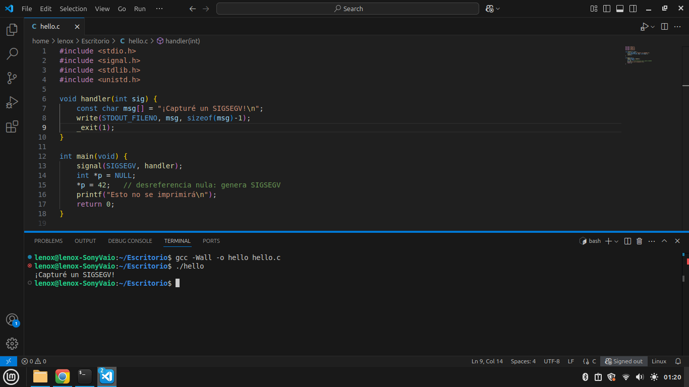]()
  El programa termina solo

  ---


# Intentando firmar un Modulo de Kernel

### 1. Precondiciones

   1. Sistema con Secure Boot habilitado

      - Tu computadora debe arranca con Secure Boot activo en el firmware UEFI.

   2. Paquetes necesarios
      ```bash
      sudo apt-get update
      sudo apt-get install build-essential linux-headers-$(uname -r) openssl mokutil
      ```
   
### 2. Generar par de claves (MOK) y certificado

   1. Creamos un archivo de configuración de OpenSSL
   Creamos un archivo llamado "ModuloFirmado.cnf" con este contenido (este es un ejemplo mínimo, basado en Red Hat)
      ```init
      [ req ]
      distinguished_name = req_distinguished_name
      x509_extensions = v3_ca
      prompt = no

      [ req_distinguished_name ]
      countryName = AR
      stateOrProvinceName = Cordoba
      localityName = Cordoba
      organizationName = UNC
      commonName = Lenox

      [ v3_ca ]
      basicConstraints = CA:FALSE
      keyUsage = digitalSignature
      extendedKeyUsage = codeSigning
      subjectKeyIdentifier = hash
      ```

   2. Generar la clave privada y el certificado (DER) ejecutando:
      ```bash
         openssl req -new -x509 \
      -config openssl.cnf \
      -newkey rsa:2048 -nodes \
      -keyout MOK.priv \
      -outform DER -out MOK.der \
      -days 3650
      ```
      - **newkey rsa:2048 -nodes:** genera clave RSA 2048 bits sin passphrase.

      - **outform DER -out MOK.der:** produce el certificado en formato DER, que es el que acepta mokutil.

      - **days 3650:** validez de 10 años.

      - Esto genera dos archivos:

         - **MOK.priv** (clave privada).

         - **MOK.der** (certificado público en DER). 

### 3. Inscribir la clave en UEFI (MOK)
- Ejecutando:
```bash
sudo mokutil --import MOK.der
```
Te pedirá elegir una contraseña asique recuerdala porque la necesitarás en el siguiente reinicio.

- Una vez completado, reinicia el equipo:
```bash
sudo reboot
```
- Durante el arranque, aparecerá la pantalla azul de “Enroll MOK”:

   1. Elige “Enroll MOK” o “Enroll key from disk”.

   2. Selecciona “Continue”.

   3. Ingresa la contraseña que pusiste con mokutil.

   4. Confirma “Yes” para inscribir la clave.
   
   Finalmente, se reiniciará de nuevo al sistema operativo con tu clave ya registrada en UEFI.

[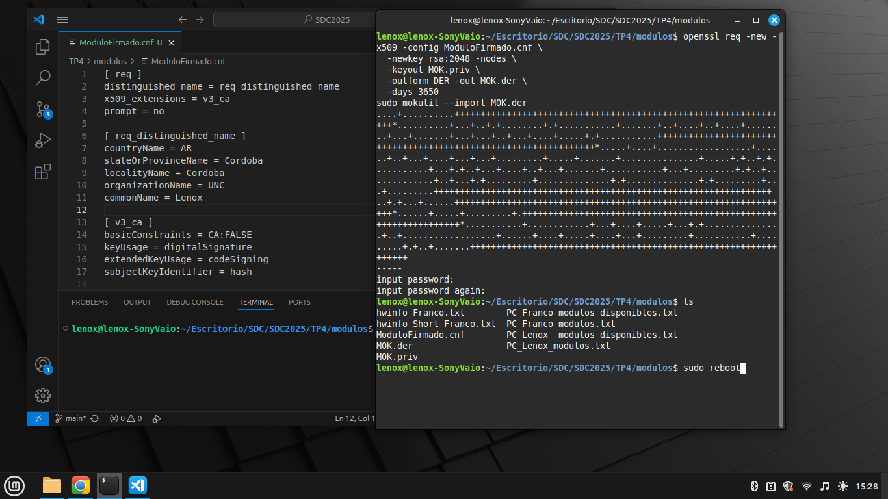]()

### 4.Preparar el módulo que imprime el hostname

Hasta ahora ya tienemos la infraestructura de firma lista. Ahora vamos a crear un módulo personalizado que, al cargarse, imprime el nombre de la máquina (hostname) en los registros del kernel.

   1. Luego de crear el Modulo (ModuloSDC.c) y su respectivo Makefile lo compilaremos con:
      ```bash
      make
      ```
   2. Verificamos su creacion con:
      ```bash
      ls -lh ModuloSDC.ko
      ```
[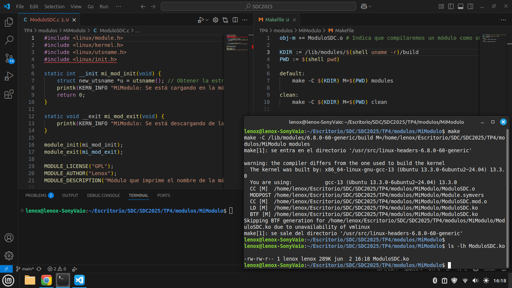]()

### 5. Firmar el módulo con sign-file

Para firmar nuestro modulo seguiremos estos pasos:
   1. Ejecuta (desde la carpeta donde esté el .ko):
      ```bash
      sudo /usr/src/linux-headers-$(uname -r)/scripts/sign-file \
         sha256 \
         ~/Escritorio/SDC/SDC2025/TP4/modulos/Firma/MOK.priv \
         ~/Escritorio/SDC/SDC2025/TP4/modulos/Firma/MOK.der \
         ModuloSDC.ko
      ```
   - Parámetros:

      - **sha256:** algoritmo de hash para la firma.

      - **MOK.priv:** clave privada generada.

      - **MOK.der:** certificado público que ya inscribimos en UEFI.

      - **ModuloSDC.ko:** módulo que se firmará.

      - Si todo sale bien, no habrá salida por pantalla y el archivo ModuloSDC.ko quedará incrustado con la firma.

   2. Verificamos la firma con:
      ```bash
      modinfo ModuloSDC.ko | grep -i signature
      ```

[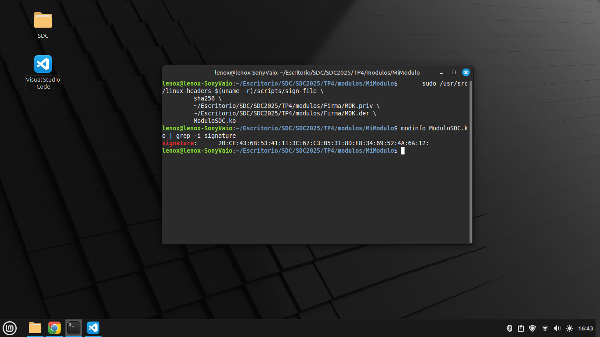]()

### 6. Cargar y descargar el módulo, y examinar dmesg
Con el módulo ya firmado, vamos a probar su carga y descarga:

   1. Cargar el módulo firmado
      ```bash
      sudo insmod ModuloSDC.ko
      ```

   2. Descargar el modulo firmado
      ```bash
      sudo rmmod ModuloSDC.ko
      ```
   
   3. Ver mensajes de descarga en dmesg
      ```bash
      dmesg | tail -n 2
      ```
[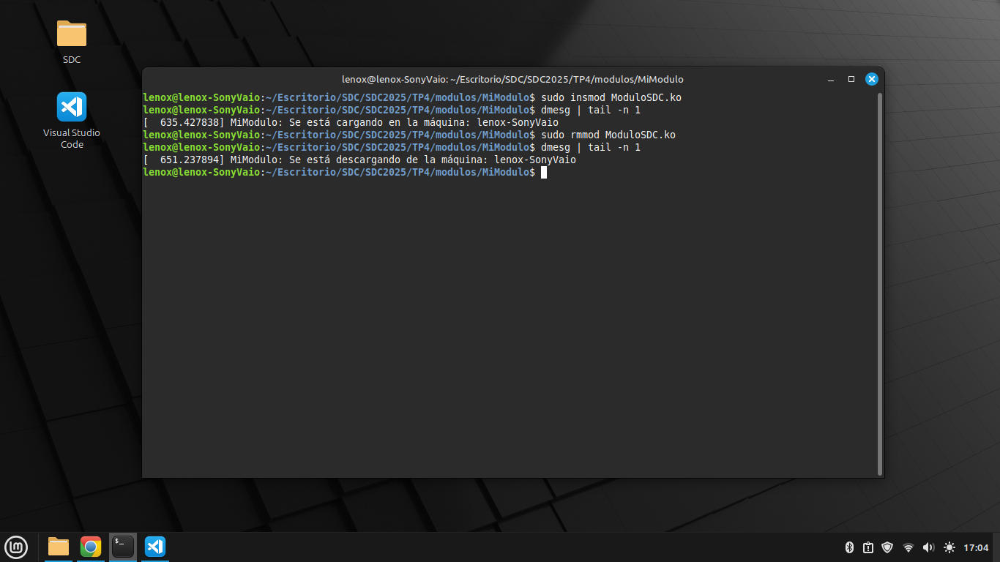]()


## ¿Qué pasa si mi compañero con Secure Boot habilitado intenta cargar un módulo firmado por mí?

Si mi compañero tiene Secure Boot habilitado, su sistema solo aceptará módulos del kernel que estén firmados digitalmente con una clave reconocida por su firmware UEFI.

Cuando yo firmo un módulo con mi propia clave (MOK.der) y lo cargo en mi computadora, funciona porque yo inscribi esa clave pública en mi firmware mediante el proceso de Enroll MOK (pantalla azul al reiniciar).

Sin embargo, esa clave no está presente en la base de claves MOK de mi compañero, así que cuando él intente cargar mi módulo el kernel lo va a rechazar.

Para que mi compañero pueda cargar el modulo tendra que importar y enrolar mi MOK.der usando:
```bash
sudo mokutil --import MOK.der
```
Y después reiniciar para aceptar la clave como lo hice yo.

## Sobre la nota de ArsTechnica:

**Fuente:**
https://arstechnica.com/security/2024/08/a-patch-microsoft-spent-2-years-preparing-is-making-a-mess-for-some-linux-users/

---

### ¿Cuál fue la consecuencia principal del parche de Microsoft sobre GRUB en sistemas con arranque dual (Linux y Windows)?

Microsoft lanzó un parche de seguridad que revocó claves de firma antiguas usadas por versiones anteriores de GRUB y shim (el cargador intermedio de Secure Boot en sistemas Linux)

Este parche se aplicó a la base de datos UEFI de claves confiables, con el objetivo de mitigar vulnerabilidades graves en la cadena de arranque. Sin embargo, muchas distribuciones Linux no habían actualizado sus cargadores GRUB con nuevas firmas válidas.

Por lo tanto:
   - Tras instalar el parche en Windows, algunos equipos con arranque dual no pudieron volver a arrancar Linux.

   - El firmware UEFI bloqueaba GRUB, mostrando errores como “Invalid signature” o simplemente saltaba GRUB y arrancaba directamente Windows.

   - Como resultado, se rompió el arranque dual para muchos usuarios.

---

### ¿Qué implicancia tiene desactivar Secure Boot como solución al problema descrito en el artículo?

Desactivar Secure Boot permite cargar cualquier GRUB o kernel sin verificar su firma, lo que soluciona el problema de arranque.

Sin embargo, esto trae varios problemas:

   - **Desactiva una capa crítica de seguridad:** ya no se controla si el código de arranque (GRUB, shim, kernel) ha sido modificado o es de una fuente confiable.

   - **El sistema queda vulnerable a bootkits o rootkits** que podrían inyectarse antes de que se cargue el kernel de Linux o Windows.

   - **Es una solución práctica, pero riesgosa,** especialmente en contextos donde la integridad del sistema es crucial (empresas, servidores, laptops personales con datos sensibles).

---

### ¿Cuál es el propósito principal del Secure Boot en el proceso de arranque de un sistema?

Secure Boot es una funcionalidad del firmware UEFI diseñada para: 

   - "Evitar que se ejecute código no autorizado o malicioso durante el arranque del sistema."

Funciona así:

   1. La UEFI tiene una base de datos de claves públicas confiables.

   2. Solo permite arrancar cargadores (shim, GRUB, bootx64.efi, etc.) firmados con alguna de esas claves.

   3. A su vez, esos cargadores solo ejecutan núcleos (vmlinuz, initrd) y módulos firmados válidamente.

   4. Esto asegura una cadena de confianza desde el firmware hasta el kernel.

Es una medida clave contra:

   - Bootkits: malware que se carga antes del sistema operativo.

   - Rootkits persistentes: software malicioso que permanece incluso tras reinstalar el SO