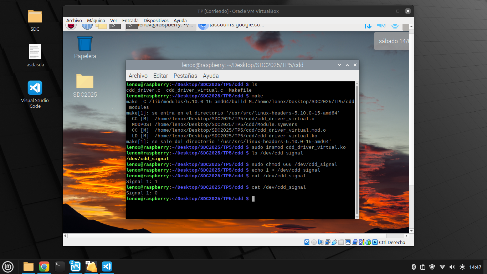
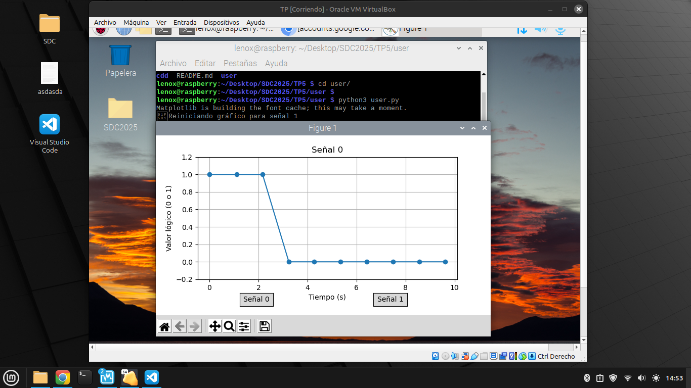

# TP - Device Driver (CDD) para sensado de señales externas

## Objetivo del Trabajo Práctico

El objetivo de este Trabajo Práctico es diseñar e implementar un Controlador de Dispositivo de Caracteres (CDD) en Linux que permita sensar dos señales externas con un periodo de un segundo. 

El sistema debe incluir una aplicación en espacio de usuario capaz de:
- Elegir cuál de las dos señales desea sensar.
- Leer periódicamente dicha señal desde el dispositivo /dev.
- Graficar la evolución de la señal en función del tiempo.
- El CDD debe exponer una interfaz de escritura que permita al usuario seleccionar entre las señales disponibles y una interfaz de lectura que retorne el valor actual de la señal elegida.

Además, el graficador debe:
- Mostrar el tipo de señal seleccionada.
- Etiquetar correctamente los ejes (tiempo en abscisas y valor lógico en ordenadas).
- Resetearse automáticamente cada vez que se cambie la señal a sensar.
- Aplicar las correcciones de escala necesarias desde espacio de usuario, si correspondiera.

Aunque se recomienda utilizar una Raspberry Pi real para el desarrollo, en este trabajo se utilizó un entorno de máquina virtual (VirtualBox) con Linux Debian para simular las señales, dado que no se contaba con ningun tipo de hardware físico.

## Descripción general del sistema
El sistema desarrollado está compuesto por dos partes principales:

1. **Módulo del kernel (CDD)**

Se diseñó un Controlador de Dispositivo de Caracteres (CDD) que, una vez cargado en el kernel, crea el dispositivo /dev/cdd_signal. Este permite:

- Simular dos señales digitales con un periodo de un segundo.
- Elegir cuál de las dos señales sensar escribiendo 0 o 1 al dispositivo desde espacio de usuario.
- Leer el valor actual de la señal seleccionada desde el dispositivo /dev/cdd_signal.

Dado que el entorno de desarrollo es una máquina virtual sin GPIO físico, las señales fueron simuladas mediante un temporizador del kernel (timer_list) que se ejecuta cada segundo, generando valores alternantes (0 y 1) de forma controlada.

 2. **Aplicación de usuario (graficador)**

Se desarrolló una aplicación en Python 3 utilizando las librerías matplotlib y animation que cumple con los siguientes requisitos:
- Permite seleccionar interactivamente (mediante botones gráficos) cuál señal graficar.
- Lee cada segundo el valor actual desde /dev/cdd_signal.
- Grafica en tiempo real la evolución de la señal seleccionada.

Muestra correctamente:
- El tipo de señal que se está sensando.
- El eje X con unidades de tiempo en segundos.
- El eje Y con el valor lógico de la señal (0 o 1).
- Al cambiar de señal, el gráfico se reinicia automáticamente y comienza una nueva serie.

Este diseño modular separa correctamente las responsabilidades entre espacio de kernel (generación y control del dispositivo) y espacio de usuario (interacción, visualización y lógica de control de escala).

## Diseño del driver (CDD)

El módulo del kernel desarrollado implementa un dispositivo de caracteres que expone una interfaz en /dev/cdd_signal. Su diseño se basa en la creación y gestión de un dispositivo que simula dos señales digitales con comportamiento periódico.

**Características principales del driver**
- Dispositivo creado: /dev/cdd_signal
- Número de señales simuladas: 2 (llamadas señal 0 y señal 1)
- Periodo de simulación: 1 segundo (simulado mediante timer_list)
- Manejo de escritura: el usuario puede seleccionar qué señal desea leer enviando '0' o '1'
- Manejo de lectura: devuelve una línea de texto con el valor actual de la señal seleccionada

**Estructura del driver**

El driver utiliza las siguientes funciones clave del núcleo de Linux:
- alloc_chrdev_region(), cdev_init(), cdev_add(): para registrar el dispositivo de caracteres.
- class_create(), device_create(): para hacerlo visible en /dev/.
- timer_setup() + mod_timer(): para ejecutar periódicamente la lógica de simulación.
- file_operations: define los callbacks .open, .release, .read y .write.

**Simulación de señales**

Dado que el entorno carece de GPIO físico (como ocurre en una Raspberry Pi), las señales se simulan así:
```bash
signal_value[0] = jiffies % 2;
signal_value[1] = (jiffies / HZ) % 2;
```

- Señal 0 alterna entre 0 y 1 muy frecuentemente (pero solo se evalúa cada segundo, lo que la hace parecer pseudorandom).
- Señal 1 alterna de forma estricta cada segundo (frecuencia 1 Hz).

Ambas son actualizadas en el timer_callback() que se ejecuta cada 1000 ms usando jiffies + msecs_to_jiffies(1000).

**Interfaz con el usuario**

Para permitir que el usuario indique cuál de las dos señales desea sensar, se optó por implementar la selección mediante escritura simple al dispositivo (write()), utilizando comandos

| Operación                  | Funcionalidad                                                                     |
| -------------------------- | --------------------------------------------------------------------------------- |
| `echo 0 > /dev/cdd_signal` | Selecciona la señal 0 para lectura                                                |
| `echo 1 > /dev/cdd_signal` | Selecciona la señal 1 para lectura                                                |
| `cat /dev/cdd_signal`      | Devuelve: Signal X: Y, donde X es la señal seleccionada y Y su valor actual |

El driver también imprime información en el kernel log mediante printk, lo que permite depurar y observar el comportamiento con dmesg.

En un entorno de producción o para estructuras de datos más complejas, se podría haber implementado ioctl o sysfs. Sin embargo, para este caso, la escritura de un solo carácter ('0' o '1') es suficiente

## Aplicación de usuario

Para cumplir con la consigna de leer y graficar una de las dos señales en tiempo real desde espacio de usuario, se desarrolló una aplicación en Python 3 utilizando las librerías matplotlib, animation y Button para construir una interfaz gráfica.

 **Funcionalidad principal**

La aplicación:
- Permite al usuario seleccionar cuál de las dos señales sensar mediante dos botones (Señal 0 y Señal 1).
- Realiza una lectura del valor actual de la señal seleccionada desde el dispositivo /dev/cdd_signal una vez por segundo.
- Grafica el valor leído en tiempo real, acumulando una curva temporal de la señal elegida.
- Al cambiar de señal, el gráfico se reinicia automáticamente, reiniciando el eje de tiempo y borrando la serie anterior.


## Pruebas realizadas
Se realizaron diversas pruebas manuales para validar el correcto funcionamiento tanto del Controlador de Dispositivo de Caracteres (CDD) como de la aplicación de usuario en Python

 1. Carga y creación del dispositivo

Comando:
```bash
sudo insmod cdd_driver.ko
ls /dev/cdd_signal

```

 2. Selección de señal desde espacio de usuario
```bash
echo 0 > /dev/cdd_signal
cat /dev/cdd_signal
```
[]()

3. Prueba de la app Python

```bash
python3 user.py
```
[]()
[]()

## Conclusion

Durante el desarrollo de este trabajo práctico, se abordaron conceptos avanzados de programación en espacio de kernel y espacio de usuario en Linux. Si bien en principio la consigna parecía sencilla, en la práctica surgieron varios desafíos que requirieron investigación y adaptación, especialmente en lo referido al entorno de trabajo.

- Dificultades encontradas
  - Uno de los principales obstáculos fue la imposibilidad de contar con una Raspberry Pi física, tal como sugiere la consigna. Inicialmente se intentó emular GPIOs usando herramientas como QEMU, gpio-mockup y qemu-rpi-gpio, pero todos los enfoques resultaron muy inestables o imposibles de integrar completamente en un entorno virtual accesible.

Finalmente, optamos por utilizar una máquina virtual (VirtualBox con Debian) y simular las señales directamente desde el kernel usando jiffies, lo que permitió cumplir todos los requisitos del TP sin hardware adicional.

Cabe destacar que la búsqueda de soluciones llevó tiempo y frustración. Afortunadamente, encontramos una guía muy útil en esta página web: "https://raspberrytips.es/raspberry-pi-os-maquina-virtual/", que nos orientó para montar un entorno de trabajo compatible con herramientas básicas de desarrollo para Raspberry Pi OS dentro de VirtualBox. Esto fue clave para avanzar.

- Evaluación general del trabajo
A pesar de las dificultades, el TP permitió poner en práctica conocimientos fundamentales sobre:
- Creación y registro de dispositivos de caracteres en Linux.
- Manejo de estructuras del kernel (cdev, timer_list, file_operations).
- Comunicación entre espacio de usuario y kernel mediante archivos especiales.
- Desarrollo de interfaces gráficas simples para visualización de señales.
- Sincronización de datos en tiempo real y diseño modular.

El sistema desarrollado cumple todos los puntos solicitados en la consigna, incluyendo la visualización gráfica con selección de señales, reinicio automático del gráfico, y simulación correcta de señales digitales con periodo de 1 segundo.

En definitiva, fue un trabajo desafiante, que nos obligó a pensar como desarrolladores de bajo nivel, a investigar nuevas herramientas y a buscar soluciones alternativas frente a las limitaciones del entorno.